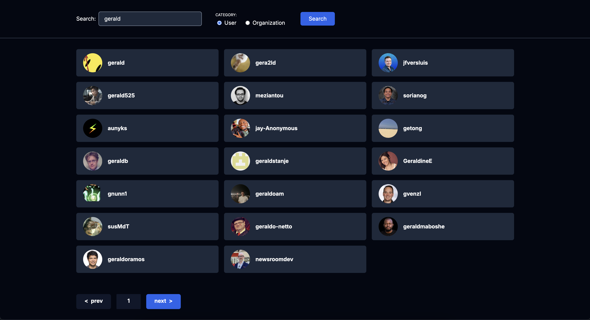

# Technical Case Study for Assembly Inc

The main goal for this exercise was retrieving user data from github, and displaying it in an accessible and responsive manner using React.

## Setup

I used vite to setup the react app with react router 7.  
You may notice that it's a bit overkill for this task, and i agree.  
Most of the boilerplate generated my vite goes unused as a result, but it was for the purpose of keeping the setup stage as short as necessary.

## State management

I opted to have search state stored as URL search params, and made other reactive states used in the app derive their values from it.  
This ensures there is a single source of truth that is fully customizable outside the app, and reproducible.  
This also allows me to use html to natively handle certain actions without relying on javascript:

- The search form submission is html native, using a `GET` method without the need for an `onSubmit` function.
- Pagination controls are just links whose `href` attributes hold the URL state they point to.

## Accessibilty

In keeping with AODA accessibility requirements (WCAG 2.0, level AA), I:

- Used dark backgrounds with light text to achieve a high contrast ratio, while not going as far as using white or black, to minmimize eye stain.
- Used semantic HTML elements to provide intrinsic accessibility and always opted for native functionality over custom roles.
- Made sure all markup was contained within landmarks.
- Auto-focused the search input when the page loads, as it is the primary control used in the page.
- Properly highlighted any elements that received focus.
- Minimized flashing after page load, by initializing/deriving UI state before the first paint.
